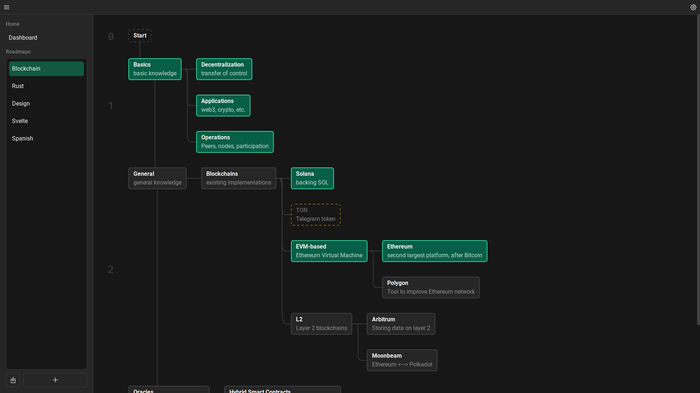

<h1 align="center">rdmp</h1>

  
  

# Implemented features

- Basic management of roadmaps and nodes.
- Export and import for individual roadmaps.
- Each node can hold more details inside in form of a markdown with preview ([example](./s2.png)).

# Planned features

- [ ] Cloud sync.
- [ ] More flexible options for layout management.
- [ ] Extended statistics and progress reports.

# Building from source

## Prerequisites

- [Rust](https://rustup.rs/)
- [Tauri](https://tauri.app/)
- Node and NPM

## Setup

1. Install js/ts dependencies from `package.json`.
2. Run tauri in development mode `cargo tauri dev`, or build `cargo tauri build`.
